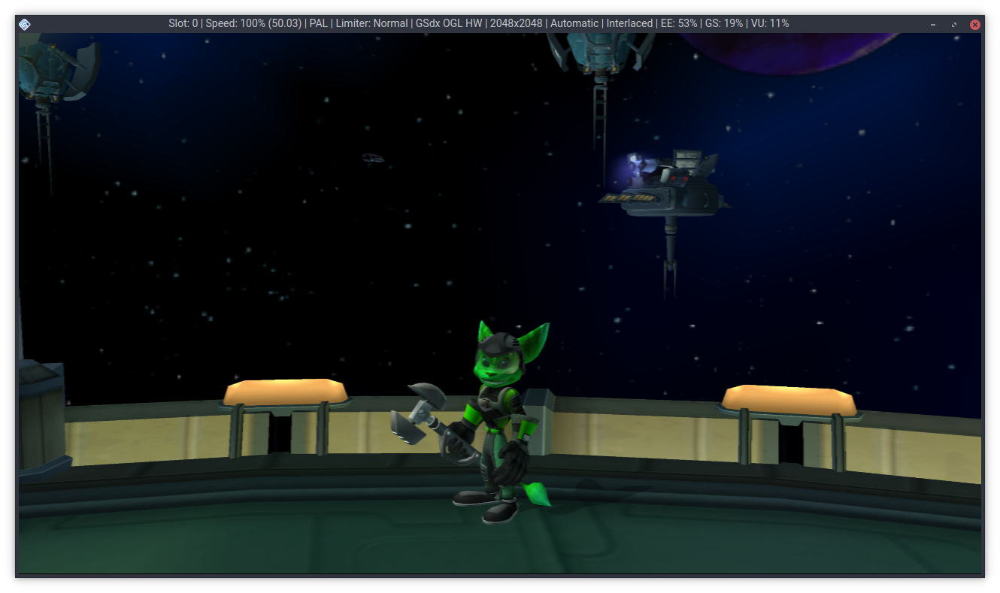

wrench
======

An early set of modding tools for the Ratchet & Clank PS2 games.

Screenshots
===========

Status
======

What works:

- Features
	- Viewing levels (only mobies currently).
	- Editing some textures.
	- Exporting a list of ingame strings.

- Technical
	- Decompressing WAD segments.
	- Converting 2FIP textures to and from BMP files.

What doesn't work:

- Features
	- Editing levels.
	- Editing ingame strings.
	- Editing some other textures including all transparent textures.

- Technical
	- Compressing WAD segments.

Building
========

Ubuntu 18.04
------------

1.	Install dependencies and tools:
	> sudo apt install git cmake g++ libglew-dev libboost-all-dev libglfw3-dev libglm-dev
2.	Download the source code using Git:
	> git clone -b master https://github.com/chaoticgd/wrench
	
	_Note: The default branch is develop, so if you don't specify `-b master` you will download a development build which will probably be unstable._

3.	Download the remaining dependencies using Git:
	> git submodule update --init --recursive
	
2.	Build it with cmake:
	> cmake . && cmake --build .

Windows
-------

Not yet.

CLI Tools
=========

- wad: Decompress WAD segments.
- fip: Extract 2FIP textures to indexed BMP files.
- scan: Scan for game data segments on the disc.

Scripts
=======

- extract_all.py: Extract all the known game segments in a given data file/ISO.
- shuffle_gui_textures.py: Shuffles all the GUI textures in a given data file/ISO.
