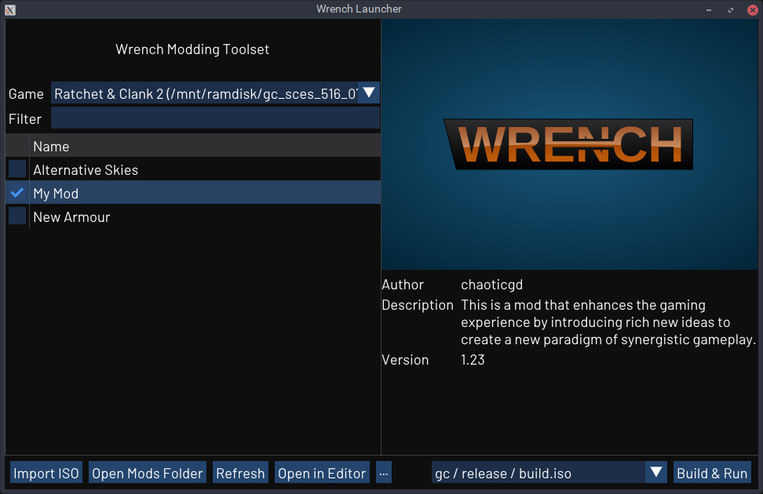

# Wrench Editor

A set of modding tools for the Ratchet & Clank PS2 games. Compatible with R&C1, R&C2, R&C3 and Deadlocked. Work in progress.

- [Releases](https://github.com/chaoticgd/wrench/releases)
- [Unstable Builds](https://github.com/chaoticgd/wrench/releases/tag/unstable)
- [Documentation](docs/README.md)

Feel free to use the issue tracker to ask questions about Wrench or technical questions about the games.

Features currently include:
- Launcher
	- A user interface to manage mods.
	- Used to launch the level editor.
- Build Tool
	- Pack/unpack entire ISO files.
	- **New in v0.4!** Pack/unpack gameplay instances as `.instances` files.
	- Unpack tfrag meshes as COLLADA files.
	- Unpack moby meshes as COLLADA files.
	- Unpack tie meshes as COLLADA files.
	- Pack/unpack collision meshes as COLLADA files.
	- Pack/unpack shrub meshes as COLLADA files.
	- Pack/unpack sky meshes as COLLADA files.
	- Pack/unpack textures as PNG files.
	- **New in v0.4!** Pack/unpack packed executables and level overlays as ELF files.
	- Pack/unpack everything else as binary files.
- Level Editor
	- View unpacked levels.
	- Inspect objects and modify their attributes (including pvars).
	- **New in v0.5!** Recover instanced collision for ties and shrubs.
	- **New in v0.5!** Translate, rotate and scale objects using 3D transformation gizmos.
- **New in v0.4!** Memory Card Editor
	- Only works properly on Deadlocked saves. Experimental.
- Asset System
	- A system to create, distribute and load mods.
	- Multiple mods can be loaded at a time.
- **New in v0.4!** Instance System
	- A source format for storing object instances.
	- Use pvar data types from C++ header files (reflection).
- **New in v0.4!** Visibility Tool
	- Rebuild occlusion data for levels on demand.
	- Implemented as an OpenGL renderer.

## Screenshots

## Building

### Linux

1.	Install the following dependencies and tools:
	- git
	- cmake
	- g++ 8 or newer
	- xorg-dev (needed to build GLFW)
	- zenity

2.	cd into the directory above where you want Wrench to live e.g. `cd ~/programs`.

2.	Download the source code and additional dependencies using Git:
	> git clone --recursive https://github.com/chaoticgd/wrench

3.	cd into the newly created directory:
	> cd wrench

4.	Build it with cmake:
	> cmake . -B bin/ && cmake --build bin/ -j 8
	
	(in the above example 8 threads are used)

### Windows

1.	Install the following tools:
	- git
	- Visual Studio (with desktop C++/cmake support)

2.	Open a Visual Studio developer command prompt.

3.	cd into the directory above where you want Wrench to live e.g. `cd c:\programs`.

4.	Download the source code and dependencies using Git:
	> git clone --recursive https://github.com/chaoticgd/wrench

5.	cd into the newly created directory:
	> cd wrench

6.	Generate cmake files:
	> cmake . -B bin/
	
	This should generate `wrench.sln` along with a few `.vcxproj` files. 
	In case no such files are generated, you can explicitly specify usage of the Visual Studio generator by running the following command:
	> cmake . -G "Visual Studio X YYYY"
	
	where `X` is the Visual Studio version and `YYYY` is the Visual Studio year (example: `Visual Studio 16 2019`)
	A complete list can be obtained by running `cmake --help`.

7.	**(Option A)** Build the project from the command line:
	
	> cmake --build bin/ --config BUILD_TYPE
	
	where `BUILD_TYPE` is one of `Debug` (very slow - not recommended), `Release` (no symbols - not recommended), `RelWithDebInfo` (recommended) or `MinSizeRel`.
	
	**(Option B)** Build the project from Visual Studio:

	Open the newly generated `wrench.sln` in Visual Studio. In the Solution Explorer, right-click on `wrench` and click `Set as Startup Project`. You should now be able to build and debug wrench using the toolbar controls and all Visual Studio features.
