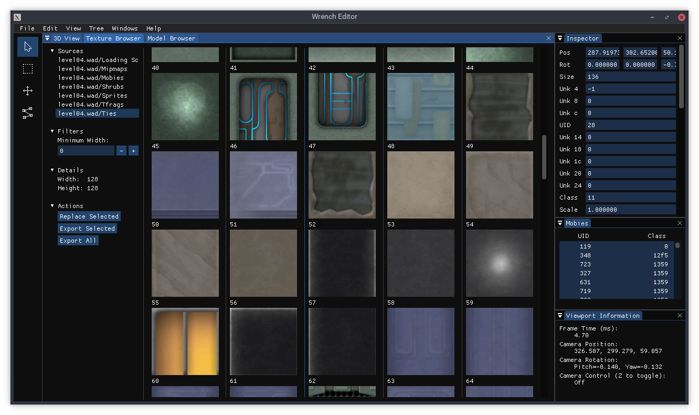
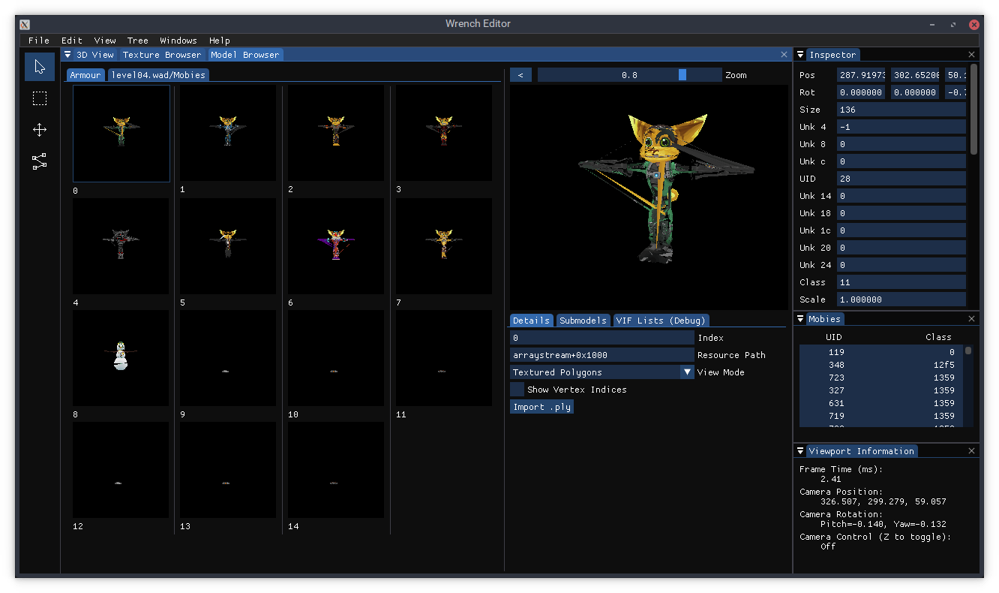

# Wrench Editor

A set of modding tools for the Ratchet & Clank PS2 games.

Current features include an ISO extractor/builder, a level editor, facilities for extracting textures, and a number of command line tools for development.

For build instructions, see the Build section below. For usage instructions, see the [User Guide](docs/user_guide.md). To find out which games are compatible, see the [Compatibility Matrix](docs/compatibility_matrix.md). For information on the game's file formats, see the [Formats Guide](docs/formats_guide.md).

## Screenshots

## Building

### Linux

1.	Install the following dependencies and tools:
	- git
	- cmake
	- g++ 8 or newer
	- xorg-dev (needed to build GLFW)
	- zenity

2.	cd into the directory above where you want Wrench to live e.g. `cd ~/code`.

2.	Download the source code and additional dependencies using Git:
	> git clone --recursive https://github.com/chaoticgd/wrench

3.	cd into the newly created directory:
	> cd wrench

4.	Build it with cmake:
	> cmake . && cmake --build . -- -j8
	
	(in the above example 8 threads are used)

### Windows

1.	Install the following tools:
	- git
	- Visual Studio (with desktop C++/cmake support)

2.	Open a Visual Studio developer command prompt.

3.	cd into the directory above where you want Wrench to live e.g. `cd c:\code`.

4.	Download the source code and dependencies using Git:
	> git clone --recursive https://github.com/chaoticgd/wrench

5.	cd into the newly created directory:
	> cd wrench

6.	Build it with cmake:
	> cmake . && cmake --build .
