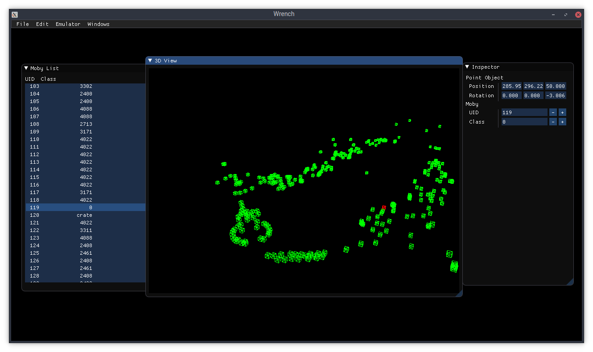

wrench
======

A very early set of modding tools for the Ratchet & Clank PS2 games.

Screenshot
===========

Status
======

The project isn't really usable for any serious modding yet.

- WAD Compression
	- [x] Decompression
	- [ ] Recompression
- Level Importing
	- Mobies (entities)
		- [x] Unique ID
		- [x] Object class/type
		- [x] Positions
		- [ ] Other attributes
	- [ ] Terrain, etc.
- Level Exporting
	- [ ] Mobies
- Texture Format
	- [x] 2FIP to BMP
	- [ ] BMP to 2FIP

Building
========

On Linux
--------

Clone the repository, init all submodules, install dependencies listed in CMakeLists.txt, then run

>	cmake .

>	cmake --build .

I will improve this section sometime in the future.

On Windows
----------

Not yet.

CLI Tools
=========

- wad: Decompress WAD segments.
- fip: Extract 2FIP textures to indexed BMP files.
- scan: Scan for game data segments on the disc.

Scripts
=======

- extract_all.py: Extract all the known game segments in a given data file/ISO.
- shuffle_gui_textures.py: Shuffles all the GUI textures in a given data file/ISO.
