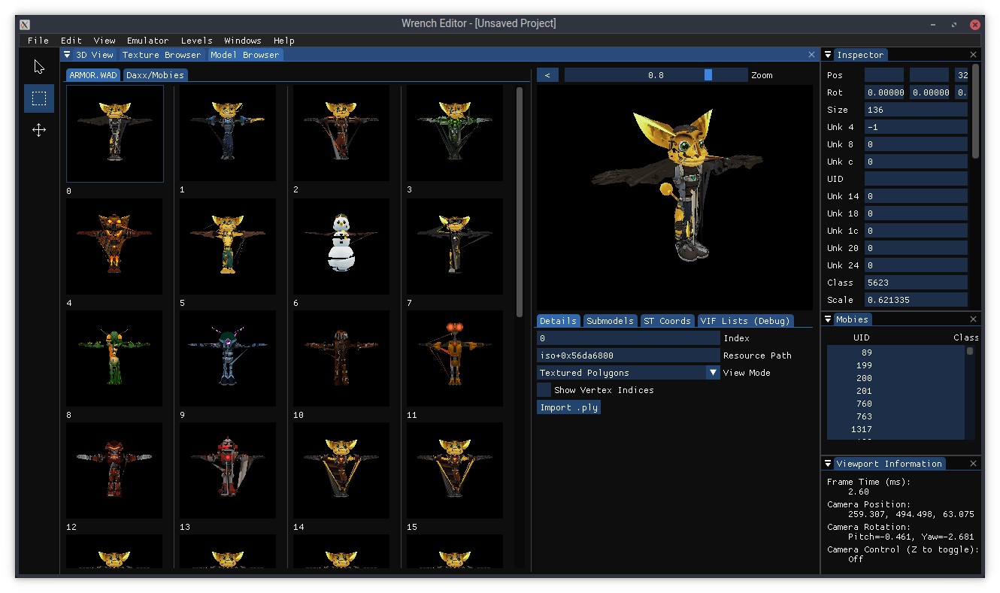

# wrench

A set of modding tools for the Ratchet & Clank PS2 games. Work in progress.

## Screenshots

## Features

- View levels from Ratchet & Clank 2, 3 and Deadlocked.
- Edit levels from Ratchet & Clank 2 and go ingame.
	- Caveat: The patching system is currently very hacky and some things may not work.
- Extract and replace certain textures.
- Decompress and recompress WAD segments (not to be confused with the *.WAD files on the game's filesystem).
- A number of command-line tools for testing.

## Compatibility

This project is probably not very usable yet, however R&C2, R&C3 and Deadlocked are currently somewhat supported, with R&C2 being supported the best. I've tested the PAL releases, however any of them should work.

## Building

### Linux

1.	Install the following dependencies and tools:
	- git
	- cmake
	- g++ 8 or newer
	- xorg-dev (needed to build GLFW)
	
	Ubuntu 18.04: You may need a newer version cmake than is available in the official repositories.

2.	cd into the directory above where you want Wrench to live e.g. `cd ~/code`.

2.	Download the source code and additional dependencies using Git:
	> git clone --recursive https://github.com/chaoticgd/wrench

3.	cd into the newly created directory:
	> cd wrench

4.	Build it with cmake:
	> cmake . && cmake --build . -- -jN
	
	where N is the number of threads to build with.
	
	On Ubuntu 18.04, to use g++ 8 (from package `g++-8`) instead of the default compiler, you can instead run:
	> cmake -DCMAKE_CXX_COMPILER=/usr/bin/g++-8 && cmake --build .

### Windows

1.	Install the following tools:
	- git
	- Visual Studio (with cmake integration)

2.	Open a Visual Studio developer command prompt.

3.	cd into the directory above where you want Wrench to live e.g. `cd c:\code`.

4.	Download the source code and dependencies using Git:
	> git clone --recursive https://github.com/chaoticgd/wrench

5.	cd into the newly created directory:
	> cd wrench

6.	Build it with cmake:
	> cmake . && cmake --build .
