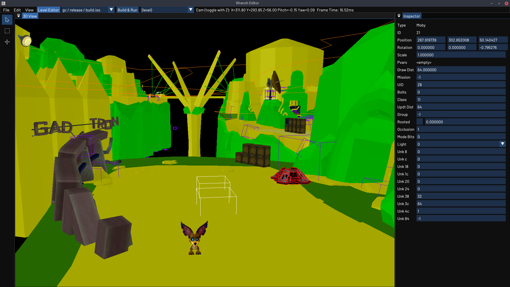

# Wrench Editor

A set of modding tools for the Ratchet & Clank PS2 games. Work in progress.

Features currently include:
- WAD Utility
  - Pack/unpack levels.
  - Export moby meshes as COLLADA files.
  - Import/export textures are PNG files.
  - Import/export collision meshes as COLLADA files.
  - Import/export everything else as binary files.
- Level Editor
  - View unpacked levels.
  - Move objects and modify their properties.
- ISO Utility
  - Extract files from R&C1, R&C2, R&C3 and Deadlocked.
  - Build modded ISO files for R&C2, R&C3 and Deadlocked.

For build instructions, see the Building section below. For usage instructions, see the [User Guide](docs/user_guide.md). For information on the game's file formats, see the [Formats Guide](docs/formats_guide.md).

## Screenshot

## Building

### Linux

1.	Install the following dependencies and tools:
	- git
	- cmake
	- g++ 8 or newer
	- xorg-dev (needed to build GLFW)
	- zenity

2.	cd into the directory above where you want Wrench to live e.g. `cd ~/code`.

2.	Download the source code and additional dependencies using Git:
	> git clone --recursive https://github.com/chaoticgd/wrench

3.	cd into the newly created directory:
	> cd wrench

4.	Build it with cmake:
	> cmake . && cmake --build . -- -j8
	
	(in the above example 8 threads are used)

### Windows

1.	Install the following tools:
	- git
	- Visual Studio (with desktop C++/cmake support)
	
	Note: Git should be in the PATH enviroment variable so that the version of Wrench being built can be identified. The Git installer has an option for this named "Git from the command line and also from 3rd-party software" under "Adjusting your PATH enviroment".

2.	Open a Visual Studio developer command prompt.

3.	cd into the directory above where you want Wrench to live e.g. `cd c:\code`.

4.	Download the source code and dependencies using Git:
	> git clone --recursive https://github.com/chaoticgd/wrench

5.	cd into the newly created directory:
	> cd wrench

6.	Build it with cmake:
	> cmake . && cmake --build . --config Release
	
	Omitting `--config Release` will build the project in Debug configuration, *which disables optimizations*.
	Note that PDBs will be generated into each target's `[...].dir` subfolder as `vc[...].pdb` instead of the `bin` directory when building in Release configuration.
