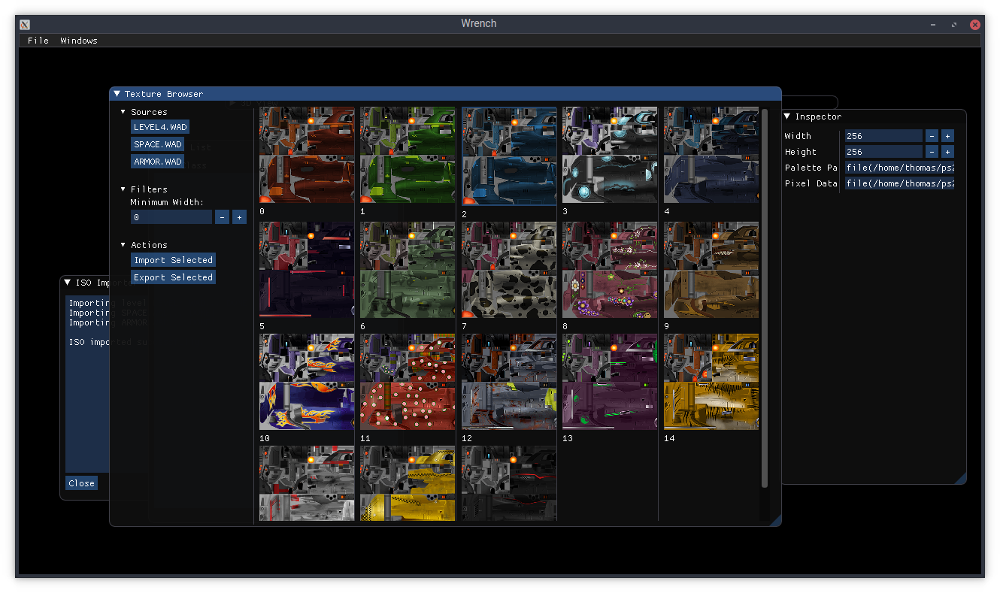

wrench
======

An early set of modding tools for the Ratchet & Clank PS2 games.

Screenshots
===========

Features
========

- View levels.
- Patching system.
- Extract and replace certain textures.
- Extract racpak (*.WAD) archives.
- Decompress WAD segments (not to be confused with the *.WAD files on the game's filesystem).

Building
========

Ubuntu 18.04
------------

1.	Install dependencies and tools:
	> sudo apt install git cmake g++ libglew-dev libboost-all-dev libglfw3-dev libglm-dev python3 python3-pydot graphviz
2.	Download the source code using Git:
	> git clone https://github.com/chaoticgd/wrench

3.	Download the remaining dependencies using Git:
	> git submodule update --init --recursive
	
2.	Build it with cmake:
	> cmake . && cmake --build .

Windows
-------

Not yet.

CLI Tools
=========

- wad: Decompress WAD segments.
- fip: Extract 2FIP textures to indexed BMP files.
- scan: Scan for game data segments on the disc.

Scripts
=======

- shuffle_gui_textures.py: Shuffles all the GUI textures in a given data file/ISO.
