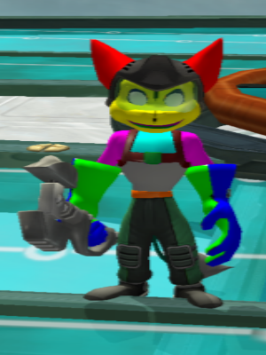

How to make custom skins
========================

This guide will step you through how to make custom skins for Ratchet & Clank 2. Note that you'll have to build wrench before you can do this. I've only tested this on Linux so far.

1. Open Ratchet and Clanks 2's ISO file in an archive manager and extract `G/ARMOR.WAD`.
2. Run `./scripts/extract_all.py ARMOR.WAD armordir` to extract all of the textures. This will also convert them to standard BMP files.
3. Open the texture you want to edit in GIMP [1].
4. Select `Image -> Mode -> RGB` to allow you to edit the texture.
5. Edit the texture.
6. Select `Image -> Mode -> Indexed` and choose `Generate optimum palette` with 256 colours in the dialog that appears.
7. Export the result to a BMP file.
8. Run `./bin/fip import <bmp file> newtexture.fip` where `<bmp file>` is the name of your newely modified BMP file to convert your texture to the native format used by the game.
9. Open the original `.fip` file that corresponds to the texture you edited (the hexadecimal number at the start of the filename will be the same) and copy its contents to the clipboard. Open the game's ISO file in a hex editor and search for the arrangement of bytes you copied to your clipboard.
10. Paste the contents of `newtexture.fip` in this position, overwriting the old data segment.

UV Guide
--------

To help you identify different parts of the texture, here's a colour-coded map:

And here are screenshots of how it looks ingame:

[1] https://www.gimp.org/
